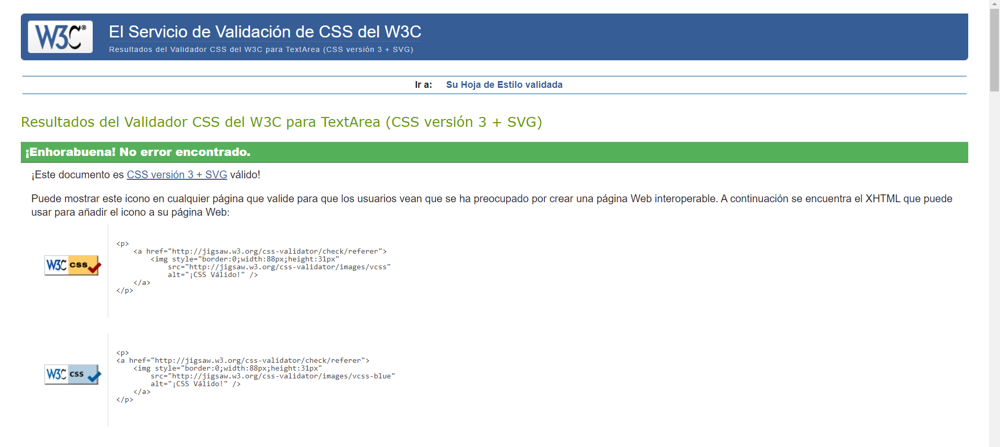

# Table of contents

- [INTERACCION PERSONA ORDENADOR](#interaccion-persona-ordenador)
  - [Introducción](#introducción)
  - [Primeros Pasos](#primeros-pasos)
  - [Hojas de estilos](#hojas-de-estilos)
  - [Aspectos Comunes](#aspectos-comunes)
  - [Google Fonts](#google-fonts)
  - [Modo Defecto](#default-blue-palette)
  - [Modo Oscuro](#dark-modo-oscuro)
  - [Modo Light](#light-modo-claro)
  - [Cambio Dinámico de Estilos](#cambio-dinámico-de-estilos)
  - [Responsividad](#responsividad)
    - [Escritorio](#escritorio)
    - [Móviles](#smartphones)
  - [Conclusiones](#conclusiones)

# INTERACCION PERSONA ORDENADOR

## Introducción

La tarea a realizar es una hoja de estilos para el documento HTML de Interfaces Imaginadas.

Se propone como solución tres stylesheets CSS junto a un pequeño script JS cuya funcion será realizar el switch entre ellos.

## Primeros Pasos

El primer paso a realizar ha sido realizar una modificación del documento HTML dado para por una parte validarlo y por otra parte adaptarlo de cierta forma a la plantilla que se nos proponia en el documento Word.\La siguiente imagen muestra la verificación del CSS y del HTML.

\
Imagen antes y después de pasar por el validador:


\
Imagen de los estilos validados:

 
 
 

Además para facilitar el uso de CSS, se ha modificado ciertos IDs y añadido clases al documento de la forma en la que se explicará a continuación.

## Hojas de estilos

Cada una de las interfaces surge como una versión de la otra puesto que al estar destinadas para el mismo sitio web, la intención es garantizar que el usuario no sienta que las cosas han cambiado de lugar. Los cambios realizados son meramente estéticos y se puede acceder a las otras interfaces desde la propia página.

### Aspectos Comunes

Bordes redondeados para las tablas, padding, estilos de las tablas y bordes para los incrustados de los videos de youtube.

### Google Fonts

Se ha elegido el repositorio de [*Google Fonts*](https://fonts.google.com/) para las tipografías de las plantillas.

Las familias de fuentes añadidas han sido:

> Bebas Neue.\
> Libre Baskerville.\
> Oswald PT Sans.\
> Source Serif Pro.

Los estilos aportados como solución son los siguientes:

### Default (Blue Palette)

Predominancia del color azul, es la hoja de estilos por defecto.

A continuación se muestran extractos de las clases y los identificadores propios añadidos con la intención de segregar el código y poder organizarlo mejor a la hora de diseñar la interfaz.

```css

  
  .minilink {
    margin-left: -20vw;
    margin-right: -19vw;
    font-size: 2vw;
    font-style: italic;
    font-family: 'Source Serif Pro', serif;
  }
  /*FIN DECLARACION ENLACES*/
  /*DECLARACION SECTION*/
  .section_title {
    margin-top: -3vw;
    
    font-style: italic;
  }
  
  .section_text {
    margin-left: -3vw;
    margin-right: -3vw;
    /*HAY QUE EMPLEAR EL CANAL ALFA PARA CONSEGUIR LA
    OPACIDAD PARA EL FONDO PERO NO PARA EL TEXTO.*/
    background-color: rgba(0, 0, 0, 0.65);
    font-size: 2vw;
    background-size: cover;
    font-family: 'Libre Baskerville', serif;
    padding: 10vw;
    color: white;
  }
  
  .section {
    margin-top: 8vw;
    text-align: center;
    color: white;
    text-shadow: 1px 1px 1px black;
    font-family: 'Bebas Neue', cursive;
    font-size: 2.75vw;
  }
  

  
  td {
    /*DOTAR DE MAS ESPACIO ENTRE LOS ELEMENTOS DE LA TABLA*/
    padding: 4vw;
    text-align: center;
    font-size: 1.75vw;
    font-family: 'Libre Baskerville', serif;
  }
  
  th {
    background-color: rgba(171, 171, 255, 0.65);
    text-align: center;
    font-size: 2vw;
  }
  
  th:first-of-type {
    border-top-left-radius: 12px;
  }
  
  th:last-of-type {
    border-top-right-radius: 12px;
  }
  
  tr:last-of-type td:first-of-type {
    border-bottom-left-radius: 12px;
  }
  
  tr:last-of-type td:last-of-type {
    border-bottom-right-radius: 12px;
  }
  

  
  /*FIN MEDIA SETTINGS*/
  /*TECNOLOGIAS*/
  .subsection_title {
    font-family: 'PT Sans Caption', sans-serif;
    ;
    margin-top: 2vw;
    font-size: 2vw;
  }
  
  
  .subsection_text {
    overflow-x: hidden;
    padding: 10vw;
    margin-top: 2vw;
    margin-left: -3vw;
    margin-right: -3vw;
    padding: 4.5vw;
    /*Se modifica el canal alfa para conseguir opacidad*/
    background-color: rgba(0, 0, 0, 0.65);
    font-size: 2vw;
    background-size: cover;
    font-family: 'Libre Baskerville', serif;
  }
  
  /*END TECNOLOGIA*/

Por su parte los identificadores.
```css  
  
 
  /*IMPACTO*/
  #impacto_title {
    margin-block-start: 0.5vw;
    margin-left: -1vw;
  }
  
  #lista_desordenada {
    margin-right: -3vw;
    margin-left: -7vw;
    margin-block-start: 1vw;
    padding: 10vw;
  }
  
  /*END IMPACTO*/
  /*REFERENCIAS SETTINGS*/
  #Referencias {margin-left: -2vw;
    margin-block-start: 20vw;
  }
  
  #refs_list {
    background-color: rgba(158, 158, 199, 0.65);
    padding: 6vw;
    margin-bottom: -10vw;
    
    margin-right: -3vw;
    font-style: italic;
    font-size: 2vw;
    text-align: justify;
  }
```

Además el hover del enlace está configurado para ser morado con un bordeado transparente:

```css
color: #7a5dffba; 
```

Tal y como se puede ver en el código, y como se reitera en esta memoria, se han añadido tablas para organizar la información de manera más eficiente.

Se ha añadido una imagen de fondo junto a un background en gradiente cuya simpleza aporta elegancia a la interfaz.

### Dark (Modo Oscuro)

A título personal es la interfaz que a diario uso en otras plataformas y la he decidido implementar por dicho motivo.

A continuación se muestra una herramienta [*diff*](https://www.diffnow.com/). para mostrar los cambios en el código con respecto a la plantilla por defecto.


Las principales diferencias evidencian a la vista, se ha seleccionado como color predominante el negro, la tipografía se ha mantenido y se ha cambiado el hover a casi negro.

A continuación se muestran los cambios de color realizados en la hoja de estilos.

```css
body {
    background: linear-gradient(to top, #000000ba, #0d0d14cc), url("../bg.jpeg") repeat;
    overflow-x: hidden;
  }
  a {
    color: white;
    text-decoration: none;
  }
  
  a:hover {
    background-color: transparent;
    color: #ffffff53;
  }
  .section_text {
    margin-left: -3vw;
    margin-right: -3vw;
    /*HAY QUE EMPLEAR EL CANAL ALFA PARA CONSEGUIR LA OPACIDAD PARA EL FONDO PERO NO PARA EL TEXTO.*/
    background-color: rgba(0, 0, 0, 0.65);
    font-size: 2vw;
    background-size: cover;
    font-family: 'Libre Baskerville', serif;
    padding: 10vw;
    color: white;
  }
  
  .section {
    margin-top: 8vw;
    text-align: center;
    color: white;
    text-shadow: 1px 1px 1px black;
    font-family: 'Bebas Neue', cursive;
    font-size: 2.75vw;
  }
  table {
    border-collapse: separate;
    border-color: #ffffff53;
    border-radius: 8px;
    margin-top: 3vw;
    width: 100%;
    height: auto;
    font-family: 'Libre Baskerville', serif;
  }
  th {
    background-color: #ffffff53;
    ;
    text-shadow: 3px 3px 3px rgb(0, 0, 0);
    text-align: center;
    font-size: 2vw;
  }
  .subsection_text {
    overflow-x: hidden;
    padding: 10vw;
    margin-top: 2vw;
    margin-left: -3vw;
    margin-right: -3vw;
    padding: 4.5vw;
    /*HAY QUE EMPLEAR EL CANAL ALFA PARA CONSEGUIR LA OPACIDAD PARA EL FONDO PERO NO PARA EL TEXTO.*/
    background-color: rgba(0, 0, 0, 0.65);
    font-size: 2vw;
    background-size: cover;
    font-family: 'Libre Baskerville', serif;
  }
   #refs_list {
    background-color: rgba(20, 20, 25, 0.65);
    padding: 6vw;
    margin-bottom: -10vw;
    
    margin-right: -3vw;
    font-style: italic;
    font-size: 2vw;
    text-align: justify;
  }
```

Con la intención de añadir contraste se ha incorporado sombras de un pixel a esta interfaz.

## Light (Modo Claro)

Presenta ligeras modificaciones con respecto a la anterior interfaz. Es la plantilla complementaria al modo oscuro presente en todo tipo de sitios web actuales. Predomina el color blanco en contraste con el padding oscuro en las diferentes secciones.

Además, se añade un mayor sombreado a la tipografía para conseguir que la fuente destaque en la interfaz.

A continuación se muestra la salida de la herramienta [*diff*](https://www.diffnow.com/).


```css
 body {
    background: linear-gradient(to top, #ffffffba, #a5a5a8cc), url("../bg.jpeg") repeat;
    overflow-x: hidden;
  }
  
  /*DECLARACION ENLACES*/
  a {
    color: rgb(0, 0, 0);
    text-decoration: none;
  }
  
  a:hover {
    background-color: transparent;
    color: #0c0606b0;
  }
  
  a:hover:after {
    color: transparent;
  }
  
  
  .section_text {
    margin-left: -3vw;
    margin-right: -3vw;
    /*HAY QUE EMPLEAR EL CANAL ALFA PARA CONSEGUIR LA OPACIDAD PARA EL FONDO PERO NO PARA EL TEXTO.*/
    background-color: rgba(255, 255, 255, 0.65);
    font-size: 2vw;
    background-size: cover;
    font-family: 'Libre Baskerville', serif;
    padding: 10vw;
    color: rgb(0, 0, 0);
  }
  
  .section {
    margin-top: 8vw;
    text-align: center;
    color: rgb(0, 0, 0);
    font-family: 'Bebas Neue', cursive;
    font-size: 2.75vw;
  }
  
  td {
    /*DOTAR DE MAS ESPACIO ENTRE LOS ELEMENTOS DE LA TABLA*/
    padding: 4vw;
    text-align: center;
    font-size: 1.75vw;
    text-shadow: 1px 1px 1px rgb(124, 124, 124);
    font-family: 'Libre Baskerville', serif;
  }
  
  th {
    font-size: 3vw;
    color: white;
    text-shadow: 3.5px 3.5px 3.5px rgb(127, 123, 123);
    text-shadow: 3px 3px 3px rgb(0, 0, 0);
    background-color: #00000053;
    ;
    text-align: center;
    font-size: 2vw;
  }
  
  #refs_list {
    background-color: rgba(255, 255, 255, 0.65);
    padding: 6vw;
    margin-bottom: -10vw;
    
    margin-right: -3vw;
    font-style: italic;
    font-size: 2vw;
    text-align: justify;
  }
```

No es tan simple como tan sólo modificar los colores e invertirlos con la función invert() de CSS, el color blanco requiere modificar los parámetros de la tipografía así como añadir mayor sombreado para adquirir contraste.

Por otra parte, existen otros elementos que se tienen que mantener con el mismo coloreado como el header de la tabla.

## Cambio dinámico de estilos

Se ha implementado un script en JS que permite al usuario mediante selección directa en la interfaz, elegir la plantilla que mas se adecúe a su gusto.

Para incorporar JavaScript a un documento HTML es necesario añadir las siguientes líneas:

```html
<script  src="../IPO2/switcher.js"></script>
```

El script original está extraido de una guía oficial de [*W3*](https://www.w3.org/TR/WCAG20-TECHS/C29.html) .

## Responsividad

Es importante que una interfaz pueda ser accesible desde diferentes dispositivos ajustandose a las diferentes pantallas.

Para ello, es conveniente realizar el diseño siempre que sea posible en unidades de medida de relación de aspecto y no en píxeles.

En éste caso se ha utilizado la medida ViewPort (vw).
También se pueden emplear los emmets como medida de reescalado.

### Escritorio

A continuación se muestran imágenes de las tres plantillas vistas desde un ordenador:

#### Modo Por Defecto


#### Modo Oscuro


#### Modo Light


### Smartphones

A continuación se muestran imágenes de las tres plantillas simuladas en un dispositivo móvil:


Como se puede observar, se mantiene el estilo responsive.

## Conclusiones

Solución con 3 stylesheet para el sitio Interfaces Imaginadas que implementa una plantilla por defecto y dos temas complementarios.
